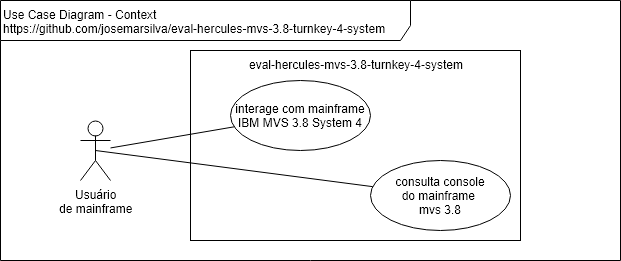
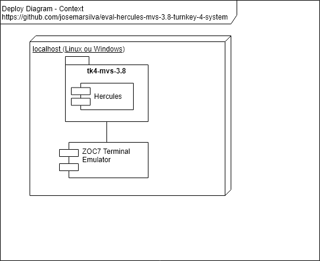

# README - eval-hercules-mvs-3.8-turnkey-4-system

## 1. Introdução

Este projeto contém avaliação do pacote **Hercules** __mainframe emulator__ com o(s) módulo(s) do sistema operaciona da IBM **MVS 3.8** que foi disponibilizado para comunidade e compilado em um pacote chamado **Turn Key 4 - System **. Ao final, você terá não somente um ambiente de simulação do Hercules mainframe, mas o sistema operacional MVS 3.8  já instalado, com a aplicação TSO.

* Instalação
  * [Windows](#321-guia-de-instalação-windows)
  * [Linux](#322-guia-de-instalação-linux)
  * [Pacote de aplicações opcionais CBT DASD](#323-pacote-de-aplicações-opcionais-CBT-DASD)
  * [Instalação Emulador Terminal ZOC TN3270](#324-instalação-emulador-terminal-zoc-tn3270)

---
## 2. Documentação

### 2.1. Use Case Diagram

 


### 2.2. Deploy Diagram

 


---
## 3. Projeto

### 3.1. Pré condições

* Sistema Operacional: ['Windows x64', 'Linux x64', 'Windows 32', 'Linux x32' ]


### 3.2. Guia de Instalação

### 3.2.1. Guia de Instalação Windows

#### a. Leitura pre instalação
* [Leia antes de iniciar - Página do TK4](http://wotho.ethz.ch/tk4-/)
* [Assista ao vídeo - instalação do TK4](https://www.youtube.com/watch?v=QTxe8ASdxE0&t=1510s)
* [Leia antes de iniciar - Página do Hercules](http://www.hercules-390.org/)

#### b. Instalação passo a passo

* Faça download do pacote **tk4-_v1.00_current.zip** na página do [TK4](http://wotho.ethz.ch/tk4-/) ou diretamente por este [link de dowload](http://wotho.ethz.ch/tk4-/tk4-_v1.00_current.zip).
* Faça download do manual **MVS_TK4-_v1.00_Users_Manual.pdf** na página do [TK4](http://wotho.ethz.ch/tk4-/) ou diretamente por este [link de dowload](http://wotho.ethz.ch/tk4-/MVS_TK4-_v1.00_Users_Manual.pdf). 

```bat
ECHO Windows não tem wget em command line ...
cd %USERPROFILE%\Downloads
ECHO Download http://wotho.ethz.ch/tk4-/tk4-_v1.00_current.zip
ECHO Download http://wotho.ethz.ch/tk4-/MVS_TK4-_v1.00_Users_Manual.pdf
```

* Descompacte os arquivos baixados no diretório definitivo de instalação

```bat
cd %USERPROFILE%\Downloads
unzip tk4-_v1.00_current.zip
unzip tk4-cbt.zip
```

* Configure o modo de execução para Console, para poder interagir com a console. Por default, o modo é deamon (serviço) e você não vai conseguir interagir com a console.

```bat
.\tk4-v1.00-current\unattended\set_console_mode
```

* Edite o arquivo de configuração `./tk4-v1.00-current/conf/tk4-.cnf` e faça os seguintes ajustes:
  * Procure a chave **NUMCPU** e troque o valor da chave de "1" para "2" - Resultado final: `NUMCPU ${NUMCPU:=2}`
  * Procure a chave **MAXCPU** e troque o valor da chave de "1" para "2" - Resultado final: `MAXCPU ${MAXCPU:=2}`
  * Procure a chave **CNSLPORT** e veja a porta TCP/IP da comunicação `CNSLPORT ${CNSLPORT:=3270}`
  * Procure a chave **HTTPPORT** e veja a porta TCP/IP da comunicação `HTTP PORT ${HTTPPORT:=8038}`

* Para executar o Hercules emulador mainframe do MVS 3.8 faça

```bat
cd %USERPROFILE%\Downloads
cd tk4-_v1.00_current
echo Executando mvs.bat
mvs.bat
```


* Para sair do Hercules emulador mainframe do MVS 3.8 faça

```hercules
herc =====> exit
```

---
### 3.2.2. Guia de Instalação Linux

#### a. Leitura pre instalação
* [Leia antes de iniciar - Página do TK4](http://wotho.ethz.ch/tk4-/)
* [Assista ao vídeo - instalação do TK4](https://www.youtube.com/watch?v=QTxe8ASdxE0&t=1510s)
* [Leia antes de iniciar - Página do Hercules](http://www.hercules-390.org/)

#### b. Instalação passo a passo

* Faça download do pacote **tk4-_v1.00_current.zip** na página do [TK4](http://wotho.ethz.ch/tk4-/) ou diretamente por este [link de dowload](http://wotho.ethz.ch/tk4-/tk4-_v1.00_current.zip).
* Faça download do manual **MVS_TK4-_v1.00_Users_Manual.pdf** na página do [TK4](http://wotho.ethz.ch/tk4-/) ou diretamente por este [link de dowload](http://wotho.ethz.ch/tk4-/MVS_TK4-_v1.00_Users_Manual.pdf). 

```sh
mkdir /opt
cd /opt
wget http://wotho.ethz.ch/tk4-/tk4-_v1.00_current.zip
wget http://wotho.ethz.ch/tk4-/MVS_TK4-_v1.00_Users_Manual.pdf
```

* Descompacte os arquivos baixados no diretório definitivo de instalação

```sh
cd /opt
mkdir hercules-mvs-3.8-turnkey-4-system
cd hercules-mvs-3.8-turnkey-4-system
unzip ../tk4-_v1.00_current.zip
unzip ../tk4-cbt.zip
echo
echo No linux pode ser necessario trocar a permissão dos arquivos binarios de execucao
echo
```

* Configure o modo de execução para Console, para poder interagir com a console. Por default, o modo é deamon (serviço) e você não vai conseguir interagir com a console.

```sh
cd /opt/hercules-mvs-3.8-turnkey-4-system/unattended
./set_console_mode
```


* Edite o arquivo de configuração `/opt/hercules-mvs-3.8-turnkey-4-system/conf/tk4-.cnf` e faça os seguintes ajustes:
  * Procure a chave **NUMCPU** e troque o valor da chave de "1" para "2" - Resultado final: `NUMCPU ${NUMCPU:=2}`
  * Procure a chave **MAXCPU** e troque o valor da chave de "1" para "2" - Resultado final: `MAXCPU ${MAXCPU:=2}`
  * Procure a chave **CNSLPORT** e veja a porta TCP/IP da comunicação `CNSLPORT ${CNSLPORT:=3270}`
  * Procure a chave **HTTPPORT** e veja a porta TCP/IP da comunicação `HTTP PORT ${HTTPPORT:=8038}`

* Para executar o Hercules emulador mainframe do MVS 3.8 faça

```sh
cd /opt/hercules-mvs-3.8-turnkey-4-system
echo Executando mvs
./mvs
```

* Para sair do Hercules emulador mainframe do MVS 3.8 faça `exit`

```hercules
herc =====> exit
```

---
### 3.2.3. Pacote de aplicações opcionais CBT DASD

* Faça download do pacote opcional **tk4-cbt.zip** na página do [TK4](http://wotho.ethz.ch/tk4-/) ou diretamente por este [link de dowload](http://wotho.ethz.ch/tk4-/tk4-cbt.zip). 

```sh
mkdir /opt
cd /opt
wget http://wotho.ethz.ch/tk4-/tk4-cbt.zip)
```

* Descompacte os arquivos baixados no diretório definitivo de instalação

```sh
mkdir /opt
cd /opt
unzip tk4-cbt.zip
```

* Copie o(s) arquivo(s) do dataset `./dasd/` da aplicação para o diretório do hercules com o TK4
* Copie o(s) arquivo(s) de configuração `./conf/cbt_dasd.cnf` da aplicação para o diretório do hercules com o TK4 (sobrepondo o antigo que está vazio)

```sh
cp /opt/tk4-cbt/dasd /opt/tk4-_v1.00_current/dasd
mv /opt/tk4-_v1.00_current/conf/cbt_dasd.cnf /opt/tk4-_v1.00_current/conf/cbt_dasd.cnf.bkp
cp /opt/tk4-cbt/conf/cbt_dasd.cnf /opt/tk4-_v1.00_current/conf
```


---
#### 3.2.4. Instalacao Emulador Terminal ZOC TN3270

* Faça o download e instale o emulador de terminal https://www.emtec.com/zoc/
* Execute o assistente de instalação ( next, next, netxt )


---
### 3.3. Guia de Configuração

* Em `/opt/tk4-cbt/conf/tk4-.cnf` encontra-se o principal arquivo de configuração do Hercules
* Certifique-se que as portas TCP/IP **3270** e **8038** e **3505** estarão disponíveis para o Hercules quando ele subir

---
### 3.4. Guia de Demonstração

* Credenciais do TSO:
  * logon: `herc01`
  * password: `CUL8TR`


### I - Referências

* [Turn Key 4 System - TK4](http://wotho.ethz.ch/tk4-/)
 dowload](http://wotho.ethz.ch/tk4-/tk4-_v1.00_current.zip)
* [Have your own mainframe](https://activedefense.us/2018/04/14/so-you-want-your-own-mainframe-hercules-z-architecture-emulator-tutorial/)
* [So you want your own mainframe](https://www.youtube.com/watch?v=-bCpzHTJNqE)
